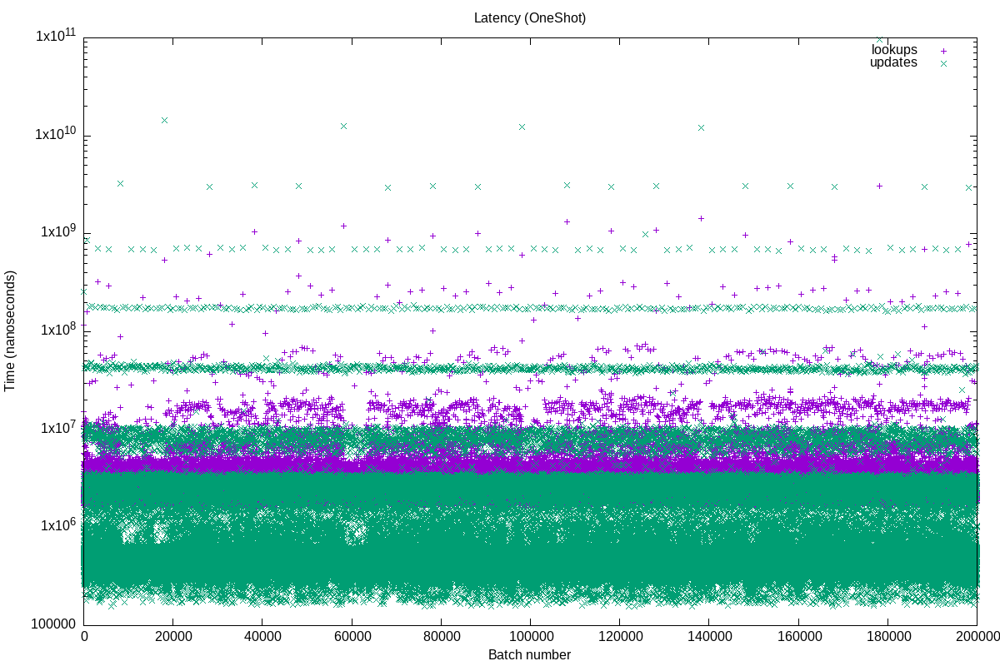
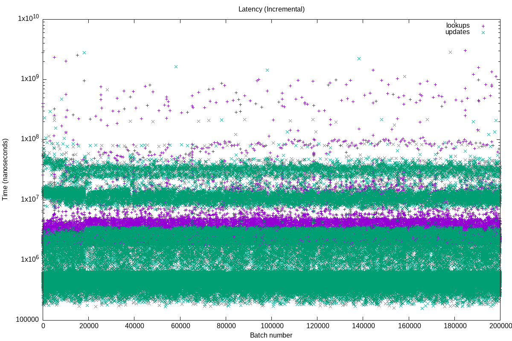
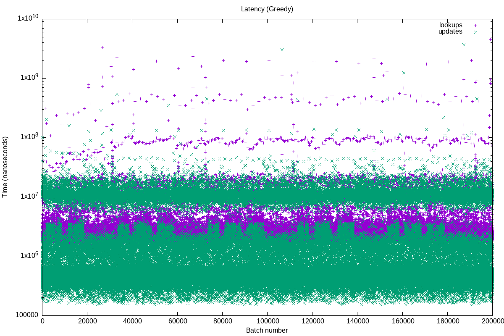
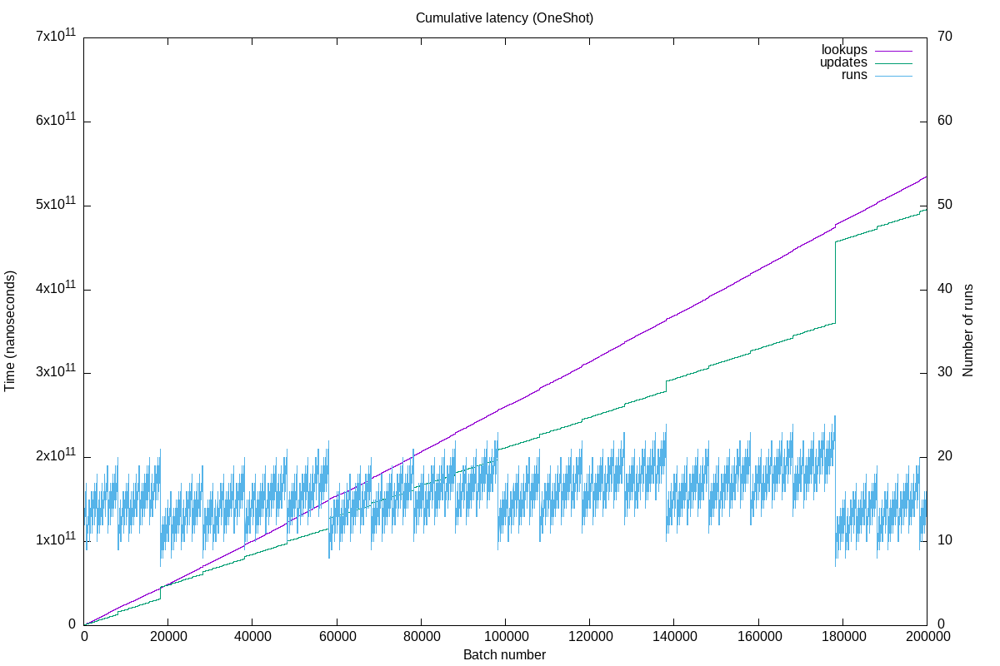
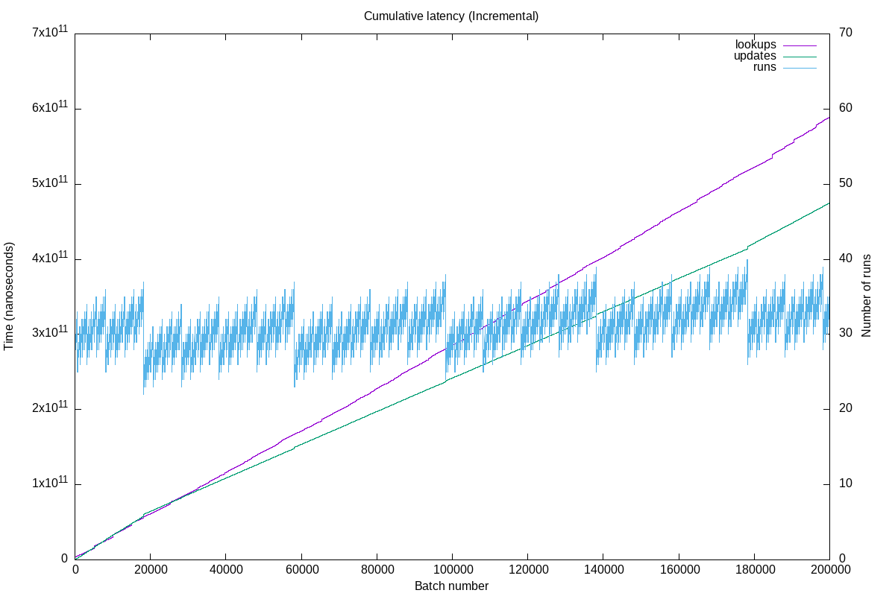
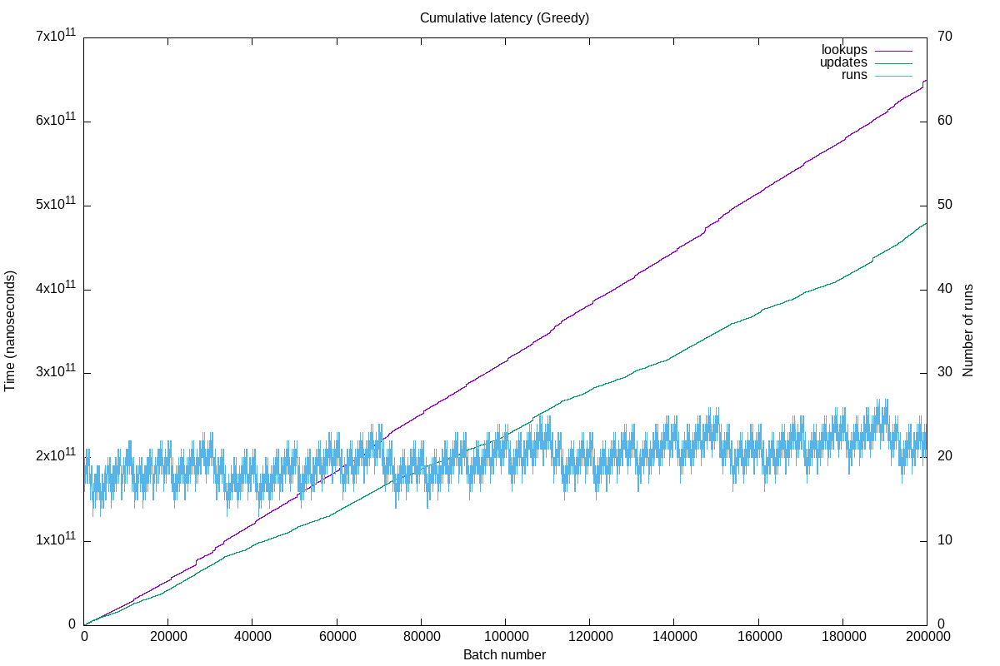

# Comparing WP8 benchmark results for different merge strategies

The `OneShot` strategy immediately completes merges when they are created.

The `Incremental` delays merging work. Each table update contributes a small amount of merging work to each ongoing merge (or rather supplies some credits and only spends them on actual work once they reach a batching threshold).

With the experimental `Greedy` merge strategy, an update does not split up its merge credit contribution equally among all ongoing merges, but supplies them to the smallest one first. The idea is that this quickly completes the small merges, immediately reducing the number of runs lookups need to consider. It also avoids an issue with the `Incremental` strategy, where an update's credit contributions cross the batching thresholds in multiple merges at once, leading to a latency spike, as an unusually large amount of merging work is performed.

The new strategy is evaluated on the WP8 macro benchmark.

## Latency

Compared to `Incremental`, the `Greedy` strategy manages to eliminate the highest band of update latencies. These were probably cases where a single update batch led to performing multiple batches of merging work.

However, there still remain latency outliers, especially for lookups. It is unclear where they come from.

## Total runtime

We tried different lengths of benchmark runs, as focussing on a specific number of batches can be (un)favorable for the different strategies. Due to the LSM shape evolving, strategies can exhibit different performance characteristics over time.

| batches | OneShot   | Incremental  | Greedy    |
| ------: | --------: | -----------: | --------: |
|   setup |  523.295s |     600.549s |  611.834s |
|     50k |  222.905s |     284.395s |  267.301s |
|    100k |  479.866s |     541.924s |  543.269s |
|    150k |  854.842s |     973.156s | 1010.370s |
|    200k | 1031.695s |    1065.256s | 1131.142s |

The `Greedy` strategy manages to be slightly ahead of `Incremental` at some points in the benchmark, but overall seems to be a little slower.

## Cumulative latency

To understand the performance differences, we calculate the *cumulative* latencies for each batch (i.e. sum of latencies of all batches submitted so far).

We also plot the number of runs that a lookup needs to query for each batch (i.e. number of runs in the level cache).

Note that updates take nearly the same total time across all strategies.
`OneShot` already completed all merges, while the other strategies still have some outstanding work, so they spent less time on updates so far.

This is also visible in the `Incremental` table having a significantly larger number of runs than the `OneShot` table, which translates to increased lookup time.

Surprisingly though, `Greedy` manages to keep the number of runs low, but nonetheless spends *even more* time on lookups.
